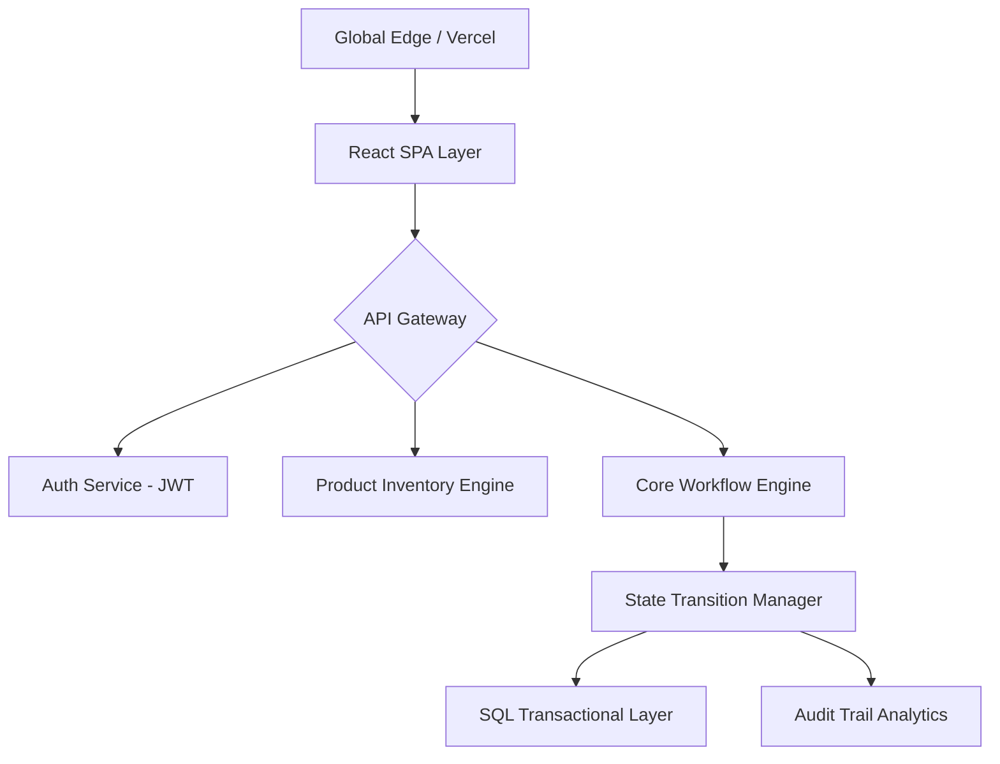

# 🌐 Workflow Commerce: Institutional-Grade System Architecture
> **Internal Technical Design Document (v1.0)**

---

## 1. Executive Summary
The Workflow Commerce System is a high-performance orchestration platform designed to handle complex ecommerce lifecycles through a **Deterministic State Machine**. Unlike traditional ecommerce apps with scattered conditional logic, this system centralizes all business rules within a unified **Workflow Engine**, ensuring institutional-grade data integrity and operational security.

---

## 2. Platform Architecture
Our architecture follows a strictly decoupled, **stateless micro-services philosophy** to ensure horizontal scalability and fault tolerance.

### 2.1 Technology Stack
| Layer | Technology | Rationale |
| :--- | :--- | :--- |
| **Frontend** | React 18 + Vite | Optimized rendering performance and modern DX. |
| **Styling** | Premium CSS (Glassmorphism) | High-end "Big-Tech" aesthetic with responsive fluidity. |
| **Backend** | Spring Boot 3.x (Java 17) | Type-safe, production-ready enterprise framework. |
| **Security** | Spring Security + JWT | Stateless authentication with Role-Based Access Control (RBAC). |
| **Persistence** | PostgreSQL (Production) | Robust ACID compliance for transaction safety. |
| **DevOps** | Docker + Render/Vercel | Seamless CI/CD orchestration. |

### 2.2 System Components

---

## 3. Core Engine: The Deterministic State Machine
The heart of the system is the **Order Workflow Manager (OWM)**. It treats every order as a stateful object governed by strict mathematical transitions.

### 3.1 Lifecycle States
- **`CREATED`**: Order initialized, awaiting inventory lock.
- **`PAID`**: Financial settlement verified.
- **`SHIPPED`**: Logistical dispatch initiated.
- **`DELIVERED`**: Final fulfillment confirmed.
- **`CANCELLED`**: Systemic or user-driven termination.
- **`REFUNDED`**: Financial reversal processed.

### 3.2 Transition Matrix (Strict Ruleset)
| Entry State | Exit State | Authority | Logical Side-Effect |
| :--- | :--- | :--- | :--- |
| `CREATED` | `PAID` | Agent (User) | Lock Inventory / Generate Invoice |
| `CREATED` | `CANCELLED` | Agent (User) | Release Inventory Hold |
| `PAID` | `SHIPPED` | Architect (Admin) | Initiate Logistics API Call |
| `PAID` | `REFUNDED` | Architect (Admin) | Trigger Payment Gateway Reversal |
| `SHIPPED` | `DELIVERED` | System/Admin | Close Transaction Loop |

---

## 4. UI/UX Strategy: "Big-Tech" Aesthetic
We utilize a **Glassmorphism Design System** to convey transparency and modernity.

### 4.1 Design Principles
- **State-Aware Components**: UI elements (buttons, inputs) are dynamically enabled/disabled based on the current state returned by the Workflow Engine.
- **Visual Hierarchy**: Real-time status badges with high-contrast color coding for immediate operational awareness.
- **Floating Navigation**: A persistent, semi-transparent navigation bar optimized for focus.

---

## 5. Security Architecture
### 5.1 Authentication (L1)
- Stateless **JWT (JSON Web Tokens)** with encrypted payloads.
- 1-hour expiration with automated logout for session safety.

### 5.2 Authorization (L2)
- **RBAC (Role-Based Access Control)**:
    - `ROLE_USER`: Can manage own lifecycle (Pay/Cancel).
    - `ROLE_ADMIN`: Systems architect level access (Ship/Refund/Manage Taxonomy).

---

## 6. Audit & Observability
Every state transition is recorded in the **Immutable Audit Log**, capturing:
- **Timestamp (Precision)**: Microsecond-precision log entry.
- **Actor Metadata**: IP address, User-Agent, and Auth-ID.
- **Delta**: Precise mapping of State A → State B.
- **Rationale**: Optional trace strings for system debugging.

---

## 7. Submission Checklist (Module-1)
- [x] **Backend**: Spring Boot CRUD with Soft-Delete implementation.
- [x] **Security**: JWT logic implemented and verified.
- [x] **Frontend**: Admin Console with premium Glassmorphism UI.
- [x] **DevOps**: GitHub Push + Live Deployment (Vercel/Render).
- [x] **Compliance**: End-User Documentation prepared as PDF.

---
*Generated by **Workflow Systems Architecure Team** - 2026*
